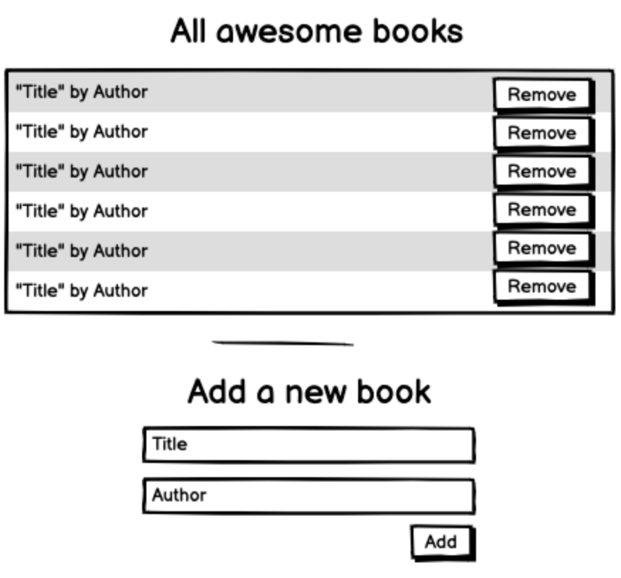

<!-- TODO -->
### Project requirements

- Setup your project:
  - Create a new directory and initialize it with git. [X]
  - Use `npm init -y` command to create package.json file. [X]
  - Create the entry point for your JavaScript code called `index.js` [X]
  - Create `index.css` file for your styles. [X]
  - Create the main `index.html` file. Link your `index.js` and `index.css` files there. [?]
  - Create a directory called `modules`. [X]
- Re-create your _Awesome books_ app following the rules:
  - Use ES6 syntax.
  - Divide your code into modules. Save each module in a separate file in the `modules` dir. Import modules in the `index.js` file. For this exercise - the more modules the better!
  - Keep all funcionalities of the app without errors.
 
- Display the current date below the navigation bar. - For this requirement you should use a library - [Luxon](https://moment.github.io/luxon/#/install)
  - Install it as a npm package: `npm install --save luxon`.
  - Import it as a module.
  - See the article [Get the current date and time](https://moment.github.io/luxon/#/tour?id=get-the-current-date-and-time). Your task here is to use a new tool effectively with little externally curated support. Exactly as you will do in your future job.

<!-- TODO -->

# Awesome Books

Awesome books is a simple website that displays a list of books and allows you to add and remove books from that list.



## Built With

- Languages: HTML, CSS and JS
- Frameworks: None
<!-- - Technologies: -->

## Live Demo

[livedemo](https://fbclh.github.io/awesome-books/)


## Getting Started

Run
```sh
   git clone git@github.com:fbclh/awesome-books
```
## Authors
### Fabio Coelho

- GitHub: [github.com/fbclh](https://github.com/fbclh)
- LinkedIn: [linkedin.com/in/fbclh](https://www.linkedin.com/in/fbclh)

##  Contributing

Contributions, issues, and feature requests are welcome, feel free to check the [issues page](../../issues/).

## License

This project is [MIT](LICENSE) licensed.
