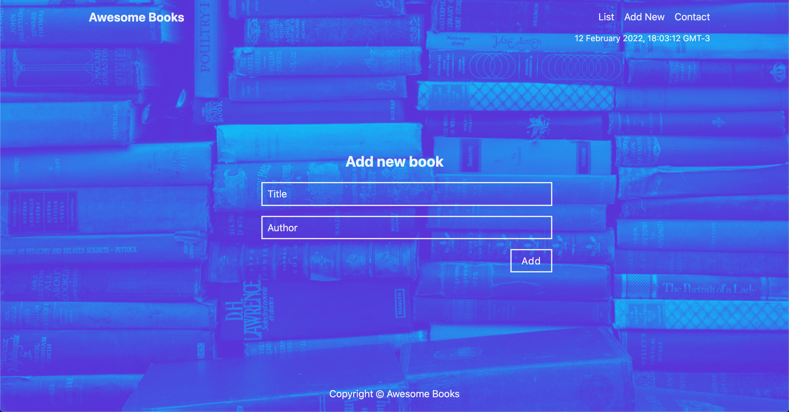

# Awesome Books

Awesome books is a simple website that displays a list of books and allows you to add and remove books from that list.



## Built With

- Languages: HTML, CSS and JS
- Frameworks: None
- Others: Parcel, npm, luxon, modern-normalize

## Getting Started

Run
```sh
   git clone https://github.com/fbclh/awesome-books-es6.git
```
Run
```sh
   npx parcel index.html      
```
Then copy and paste in the browser
```sh
  http://localhost:1234
```
## Authors
### Fabio Coelho

- GitHub: [github.com/fbclh](https://github.com/fbclh)
- LinkedIn: [linkedin.com/in/fbclh](https://www.linkedin.com/in/fbclh)

##  Contributing

Contributions, issues, and feature requests are welcome, feel free to check the [issues page](../../issues/).

## License

This project is [MIT](LICENSE) licensed.
